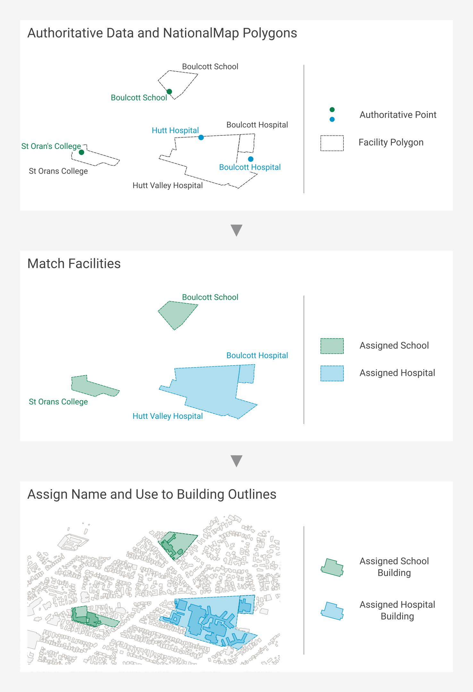
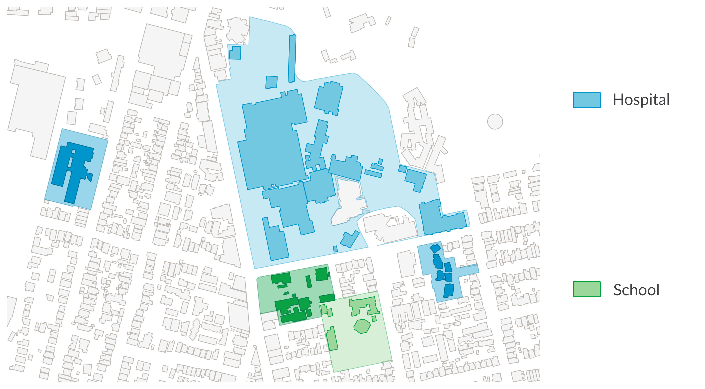

.. _introduction:

Introduction
=============================

Purpose
-----------------------------

This document provides detailed metadata (data dictionary) for the NZ Facilities data published on the LINZ Data Service: https://data.linz.govt.nz/layer/xxxx

Background
----------------------------

Facility boundaries and building outlines have been identified as a datasets of national importance. They have the potential to influence a multitude of decisions made across New Zealand at both the national and regional levels. It is therefore critical to have consistent and dynamic datasets available. In 2016 LINZ conducted a pilot project to capture building outlines over several regions of New Zealand. Since then, LINZ has published building outlines across the country, and this becomes invaluable when enriched with other datasets. With the NZ Facilities dataset described here, LINZ has published one of these datasets which enriches the attributes for the existing building outlines, as well as provides additional open data for various stakeholders to map risk modelling, environmental assessment, urban development, resilience planning in addition to the visualization and physical location of facilities and the buildings within them.
Over the next decade, the LINZ Topography Team is working towards its vision of recognising the way location information can help unlock new patterns and knowledge, particularly when it is combined with other types of information. One of our `strategic goals <https://www.linz.govt.nz/about-linz/publications/strategy/topographic-strategy-2015>`_ is to improve national scale datasets and maximize their opportunities for reuse by a variety of national and regional stakeholders.

Prior to publishing the NZ Facilities dataset, the `building outlines <https://data.linz.govt.nz/layer/101290-nz-building-outlines/>` dataset contained Name and USE attributes of only supermarkets. The NZ Facilities dataset containing hospital and school facilities was used to help add hospital and school names and uses to the building outlines dataset. These addtional building outline attributes will significantly improve this dataset for a variety of stakeholders for national resiliency purposes.

The NZ Facility data described below represents boundaries of facilities, currently hospitals and schools, within mainland New Zealand originally sourced in early 2021 from a combination of NationalMap and authoritative sources. Authoritative sources of these two types of attributes include the NZ Ministry of Health and NZ Ministry of Education.

Description
---------------------------
--what is a facility
-- what is a facility polygon/ boundary
A facility represents a particular activity, for example a school or hospital campus.
A facility boundary represents the extent of the land being as it appears to be currently used by a facility.

NZ Facilities contains data sourced from [NationalMap](https://www.nationalmap.co.nz/), [Ministry of Education](https://www.educationcounts.govt.nz/) and [Ministry of Health](https://www.health.govt.nz/) licensed for reuse under [CC BY 4.0](https://creativecommons.org/licenses/by/4.0/).

The NZ Facilities data was produced by acquiring facility boundaries from NationalMap, and matching and verifying this against authoritative data from the Ministry of Health and the Ministry of Education. Finally the facility boundaries were used to assign name and use to NZ Building Outlines.

authoritative point data of facility locations, as well as bo
-- diagram overview
-- diragram

   Image 1. Example of process to attribute building outlines from authoritative source.

Source Data
***************************
[NationalMap](https://www.nationalmap.co.nz/) Facility Boundaries, [Ministry of Education](https://www.educationcounts.govt.nz/) and [Ministry of Health](https://www.health.govt.nz/) Authoritative Points.

Verifying Facilities
***************************
The NZ Facilities data was produced by acquiring facility boundaries from NationalMap, and verifying this against authoritative point data from the Ministry of Health and the Ministry of Education.
The process of verifying the NationalMap Facilities was accomplished by first matching names and locations to an authoritative point. The matches were checked for similarity of names and distance between locations. Those with disimilar names, or large distances, were investigated further and adjusted accordingly.

Assign Attributes
***************************
name
^^^^^^^^^^^^^^^^^^^^^^^^^^^
A standardised name was created by applying a consistent naming convention to the authoritative name, for instance abbreviation such as P North modified to Palmerston North, and TKKM adjusted to Te Kura Kaupapa Maori. This standardised name was assigned to the facility boundary.
For example:
Sacred Heart Girls' College (New Plymouth)
Te Kura Kaupapa Māori o Takapau
Auckland City Hospital

source_name and source_facility_id
^^^^^^^^^^^^^^^^^^^^^^^^^^^
The authoritative sources name and source id are assigned to the data to help users link the NZ Facilities to the authoritative data.
174 - Sacred Heart Girls' College (N Plymouth)
1142 - TKKM o Takapau
F03067-A - Auckland City Hospital

use
^^^^^^^^^^^^^^^^^^^^^^^^^^^
Assign based on the facility and provides the generic use of the facility. For example, 'Hospital' or 'School'.

use_type
^^^^^^^^^^^^^^^^^^^^^^^^^^^
The main categories of a facility as defined by the authoritative source.

The FACILITY_ID provides a unique id for each facility.
• The SOURCE_FACILITY_ID provides the facility unique identifier used by the authoritative source.
• The NAME attribute provides a facility name which has consistent naming convention applied. This name may directly match the name provided by the authoritative source.
• The SOURCE_NAME attribute provides the facility name used by the authoritative source.
The USE attribute provides the generic use of the facility. For example, 'Hospital' or 'School'.
• The USE_TYPE attribute is the type of use as defined by the authoritative source.
• The USE_SUBTYPE attribute is the sub-type of use as defined by the authoritative source.
• The ESTIMATED_OCCUPANCY attribute is an approximation of the occupancy of the facility from the authoritative source, where this is known. This number may not include staff of the facility, but provides for example, the number of beds in hospitals or students in schools.
• The LAST_MODIFIED

-- points and polygons - description of this data

-- match - briefly describe matching

-- assign - how assigned to building outlines

Facility boundaries in this dataset were used to apply hospital and school building names to the NZ Building outlines dataset published on the LINZ Data Service.

Attributes
---------------------------

Source Data
***************************

Name & Use
***************************

The attributes ``name`` and ``use`` provide the building name and use for the following:

* as sourced from NZ Facilities dataset <LINK>, currently containing hospitals and schools. The name and use of the facilities have been applied to all Building Outlines where the building centroid intersects the NZ Facilities polygon.
* as sourced from supermarket company information in 2020 and applied manually to individual buildings.

   Image 3. Example of building outlines centroid intersection of NZ Facilities polygons

Accuracy Specification
---------------------------

Valid Geometry
---------------------------

Formats
---------------------------

Textual data uses UTF-8 character encoding.

The source geometry of all spatial data uses NZGD2000 / New Zealand Transverse Mercator 2000 (EPSG 2193) as the spatial reference system.

Definitions
---------------------------

.. table::
   :class: manual

+-------------------+----------------------------------------------------------------------+
| Term              | Description                                                          |
+===================+======================================================================+
| LDS               | LINZ Data Service                                                    |
+-------------------+----------------------------------------------------------------------+
| Building          | A structure generally permanent in nature which has been constructed |
|                   | to meet a specific objective (e.g. housing, storage, and workplace). |
|                   |                                                                      |
+-------------------+----------------------------------------------------------------------+
| Building Outlines | A building outline is a 2D representation of the roof outline of a   |
|                   | building.                                                            |
|                   |                                                                      |
+-------------------+----------------------------------------------------------------------+

