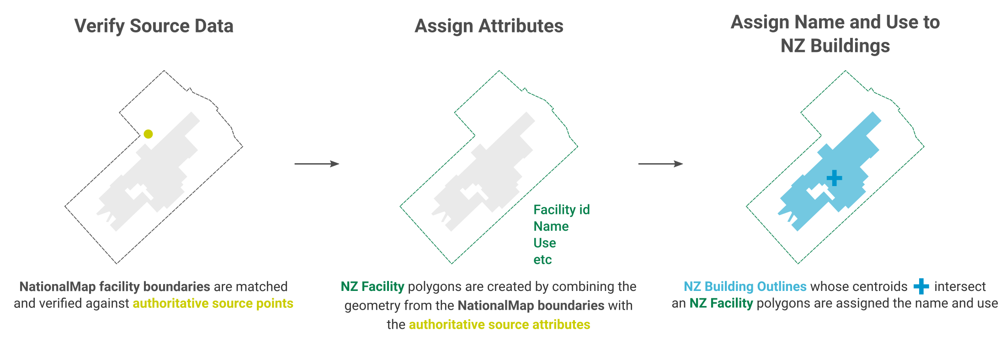
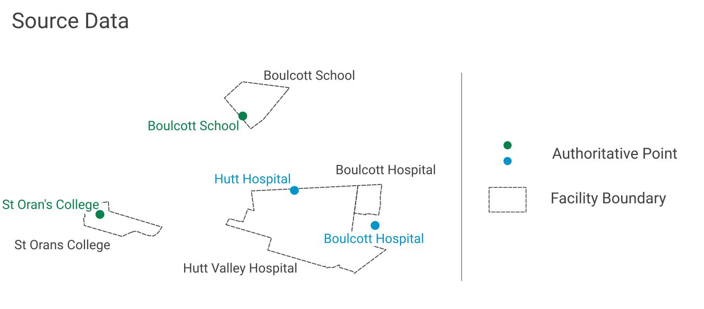
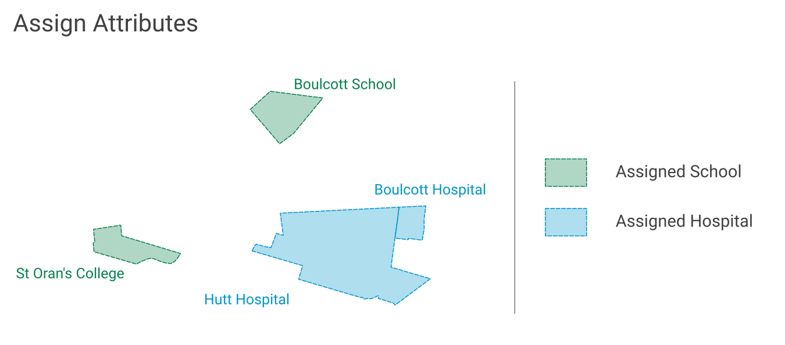
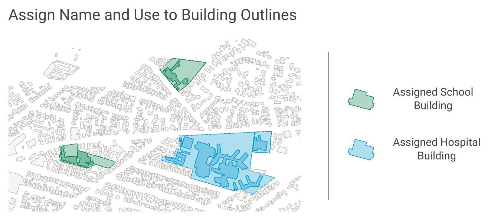

.. _introduction:

Introduction
============

Purpose
-------

This document provides detailed metadata (data dictionary) for the NZ Facilities data published on the LINZ Data Service: https://data.linz.govt.nz/layer/105568

Background
----------

The NZ Facilities dataset described here has been used to enrich the attributes for the existing `NZ Building Outlines <https://data.linz.govt.nz/layer/101290-nz-building-outlines/>`_, as well as provides additional open data for various stakeholders to map risk modelling, environmental assessment, urban development, resilience planning in addition to the visualization and physical location of facilities and the buildings within them.

Prior to publishing the NZ Facilities dataset, the `NZ Building Outlines <https://data.linz.govt.nz/layer/101290-nz-building-outlines/>`_ dataset contained name and use attributes of only supermarkets. The NZ Facilities dataset containing hospital and school facilities was used to help add hospital and school names and uses to the building outlines dataset.

Description
-----------

The NZ Facilities dataset represents boundaries of facilities, currently hospitals and schools, within mainland New Zealand containing data from `NationalMap <https://www.nationalmap.co.nz>`_, `Ministry of Education <https://www.educationcounts.govt.nz>`_ and `Ministry of Health <https://www.health.govt.nz>`_ licensed for reuse under `CC BY 4.0 <https://creativecommons.org/licenses/by/4.0/>`_.

A facility represents a particular activity such as a hospital or school. A facility boundary represents the extent of the land which appears to be used by a facility. A facility boundary can be different to corresponding cadastral parcel polygons because a facility can span across multiple parcels or be located in only part of a parcel. For example, a parcel owned by the Crown can include multiple schools and other facilities such as parks and reserves.

Data Creation process
---------------------
NationalMap facility polygons were matched and verified against authoritative data from the Ministry of Health and the Ministry of Education. Finally the facility boundaries were used to assign names and uses to `NZ Building Outlines <https://data.linz.govt.nz/layer/101290-nz-building-outlines/>`_.

   Image 1. An overview of the NZ Facilities creation process, from source data to attributed facility boundaries, and finally to assigned NZ Building Outlines.

Source Data Verification
------------------------
The process of verifying the NationalMap Facilities was accomplished by first matching names and locations to an authoritative point. The matches were checked for similarity of names and distance between locations. Those with disimilar names, or large distances, were investigated further and adjusted accordingly. LINZ Aerial Imagery was used to assist in manually correcting some boundary extents.

   Image 2. Example of facility boundaries and authoritative source points which need to be verified.

Assigning Attributes
--------------------

The NZ Facilities attributes are derived from the authoritative source attributes and have been standardised.

   Image 3. Example of NZ Facility boundaries with verified standardised names from an authoritative source, and attributes assigned.

name
^^^^

| A standardised *name* was created by applying a consistent naming convention to the authoritative name. This standardised *name* was assigned to the facility boundary, for example:

+----------------------------------------------+----------------------------------------------+
|               **source_name**                |             **name**                         |
+----------------------------------------------+----------------------------------------------+
| Sacred Heart Girls' College (N Plymouth)     | Sacred Heart Girls' College (New Plymouth)   |
+----------------------------------------------+----------------------------------------------+
| TKKM o Takapau                               | Te Kura Kaupapa Māori o Takapau              |
+----------------------------------------------+----------------------------------------------+
| Rudolf Steiner School (Chch)                 | Rudolf Steiner School (Christchurch)         |
+----------------------------------------------+----------------------------------------------+

source_facility_id
^^^^^^^^^^^^^^^^^^^

| The authoritative source's name and identifier are assigned to the data as *source_name* and *source_facility_id* to help users link the NZ Facilities to the authoritative source data, for example:

+----------------------------------------------+------------------------------------------+-------------------------+
|               **source_name**                | **Identifier from authoritative source** | **source_facility_id**  |
+----------------------------------------------+------------------------------------------+-------------------------+
| Sacred Heart Girls' College (N Plymouth)     |   School Number 174                      |       174               |
+----------------------------------------------+------------------------------------------+-------------------------+
| TKKM o Takapau                               |   School Number 1142                     |      1142               |
+----------------------------------------------+------------------------------------------+-------------------------+
| Belverdale Hospital                          |   HPI FacId F0F065-A                     |     F0F065-A            |
+----------------------------------------------+------------------------------------------+-------------------------+

use
^^^
| Assigned *use* based on the facility and provides the generic use of the facility, for example:

+----------------------------------------------+-------------------+
|               **source_name**                | **use**           |
+----------------------------------------------+-------------------+
| Sacred Heart Girls' College (N Plymouth)     |  School           |
+----------------------------------------------+-------------------+
| Taumarunui Hospital and Family Health Team   |  Hospital         |
+----------------------------------------------+-------------------+
| Belverdale Hospital                          |  Hospital         |
+----------------------------------------------+-------------------+

use_type
^^^^^^^^

| The main categories of a facility as defined by the authoritative source, assigned to the data as *use_type*, for example:

+----------------------------------------------+--------------------------------------------+------------------------+
|               **source_name**                |    **Use type from authoritative source**  | **use_type**           |
+----------------------------------------------+--------------------------------------------+------------------------+
| Sacred Heart Girls' College (N Plymouth)     | School Type Secondary (Year 7-15)          | Secondary (Year 7-15)  |
+----------------------------------------------+--------------------------------------------+------------------------+
| Sacred Heart School (Dunedin)                | School Type Contributing                   | Contributing           |
+----------------------------------------------+--------------------------------------------+------------------------+
| Taumarunui Hospital and Family Health Team   | Certification Service Type Public Hospital | Public Hospital        |
+----------------------------------------------+--------------------------------------------+------------------------+
| Belverdale Hospital                          | Certification Service Type NGO Hospital    | NGO Hospital           |
+----------------------------------------------+--------------------------------------------+------------------------+

use_subtype
^^^^^^^^^^^

| The additional subcategories of a facility as defined by the authoritative source, assigned to the data as *use_subtype*, for example:

+----------------------------------------------+--------------------------------------------+--------------------+
|               **source_name**                | **Use sub-type from authoritative source** | **use_subtype**    |
+----------------------------------------------+--------------------------------------------+--------------------+
| Taumarunui Hospital and Family Health Team   | Service Types Public Maternity, Medical    | Maternity, Medical |
+----------------------------------------------+--------------------------------------------+--------------------+
| Belverdale Hospital                          | Service Types Surgical                     | Surgical           |
+----------------------------------------------+--------------------------------------------+--------------------+

estimated_occupancy
^^^^^^^^^^^^^^^^^^^
| The approximate occupancy of the facility from the authoritative source, assigned to the data as the *estimated_occupancy*. This number may not include staff of the facility, but provides for example, the number of beds in hospitals or students in schools.

+----------------------------------------------+-----------------------------------------+-------------------------+
|               **source_name**                | **Occupancy from authoritative source** | **estimated_occupancy** |
+----------------------------------------------+-----------------------------------------+-------------------------+
| Sacred Heart School (Dunedin)                | Total School Roll 33                    |       33                |
+----------------------------------------------+-----------------------------------------+-------------------------+
| Taumarunui Hospital and Family Health Team   | Total Beds 14                           |       14                |
+----------------------------------------------+-----------------------------------------+-------------------------+
| Belverdale Hospital                          | Total Beds 15                           |       15                |
+----------------------------------------------+-----------------------------------------+-------------------------+

last_modified
^^^^^^^^^^^^^

The most recent date on which any attribute or geometry that is part of the facility was modified.

Assigning Name and Use to NZ Building Outlines
-----------------------------------------------

Facility boundaries in this dataset were used to apply hospital and school building names to the `NZ Building Outlines <https://data.linz.govt.nz/layer/101290-nz-building-outlines/>`_ dataset published on the LINZ Data Service. NZ Facilities and `NZ Building Outlines <https://data.linz.govt.nz/layer/101290-nz-building-outlines/>`_ were compared and any building outline whose centroid intersected with a facility boundary, was assign the name and use of that facility boundary.

   Image 4. Example of using NZ Facilities boundaries to assign name and use to building outlines.

Formats
-------

Textual data uses UTF-8 character encoding.

The source geometry of all spatial data uses NZGD2000 / New Zealand Transverse Mercator 2000 (EPSG 2193) as the spatial reference system. NZ Facilities geometries are stored as MultiPolygons.

Definitions
-----------

+-------------------+----------------------------------------------------------------------+
| Term              | Description                                                          |
+===================+======================================================================+
| LDS               | LINZ Data Service                                                    |
+-------------------+----------------------------------------------------------------------+
| Facility          | A place of a particular activity such as a hospital or school, which |
|                   | is often more than one building.                                     |
+-------------------+----------------------------------------------------------------------+
| Facility boundary | A boundary representing the extent of the land which appears to be   |
|                   | used by a facility.                                                  |
+-------------------+----------------------------------------------------------------------+
| Building          | A structure generally permanent in nature which has been constructed |
|                   | to meet a specific objective (e.g. housing, storage, and workplace). |
|                   |                                                                      |
+-------------------+----------------------------------------------------------------------+
| Building Outlines | A building outline is a 2D representation of the roof outline of a   |
|                   | building.                                                            |
|                   |                                                                      |
+-------------------+----------------------------------------------------------------------+
