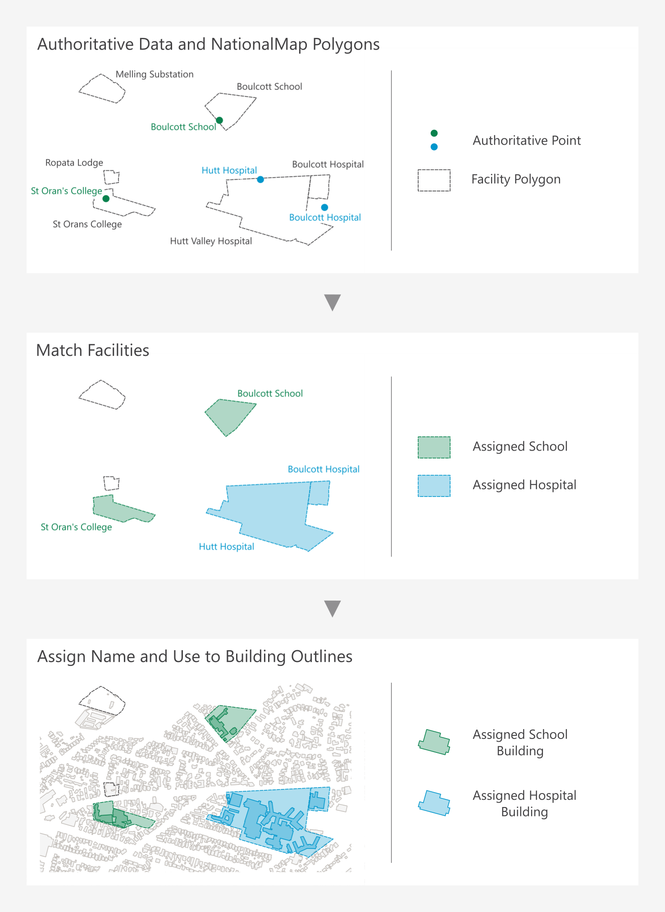

.. _introduction:

Introduction
=============================

Purpose
-----------------------------

This document provides detailed metadata (data dictionary) for the NZ Facilities data published on the LINZ Data Service: https://data.linz.govt.nz/layer/xxxx

Background
----------------------------

Facility boundaries and building outlines have been identified as a datasets of national importance. They have the potential to influence a multitude of decisions made across New Zealand at both the national and regional levels. It is therefore critical to have consistent and dynamic datasets available. In 2016 LINZ conducted a pilot project to capture building outlines over several regions of New Zealand. Since then, LINZ has published building outlines across the country, and this becomes invaluable when enriched with other datasets. With the NZ Facilities dataset described here, LINZ has published one of these datasets which enriches the attributes for the existing building outlines, as well as provides additional open data for various stakeholders to map risk modelling, environmental assessment, urban development, resilience planning in addition to the visualization and physical location of facilities and the buildings within them.
Over the next decade, the LINZ Topography Team is working towards its vision of recognising the way location information can help unlock new patterns and knowledge, particularly when it is combined with other types of information. One of our `strategic goals <https://www.linz.govt.nz/about-linz/publications/strategy/topographic-strategy-2015>`_ is to improve national scale datasets and maximize their opportunities for reuse by a variety of national and regional stakeholders.

Prior to publishing the NZ Facilities dataset, the `building outlines <https://data.linz.govt.nz/layer/101290-nz-building-outlines/>` dataset contained Name and USE attributes of only supermarkets. The NZ Facilities dataset containing hospital and school facilities was used to help add hospital and school names and uses to the building outlines dataset. These addtional building outline attributes will significantly improve this dataset for a variety of stakeholders for national resiliency purposes.

A facility polygon is a 2D representation of the boundary of a facility area as it appears to be currently used.

The NZ Facility data described below represents boundaries of facilities, currently hospitals and schools, within mainland New Zealand originally sourced in early 2021 from a combination of NationalMap and authoritative sources. Authoritative sources of these two types of attributes include the NZ Ministry of Health and NZ Ministry of Education.

Description
---------------------------

   Image 1. Example of process to attribute building outlines from authoritative source.

The publicly available building outlines data consists of three tables. The `NZ Building Outlines <https://nz-buildings.readthedocs.io/en/latest/published_data.html#table-nz-building-outlines>`_ table contains all of the building outlines which match the most recent imagery available for each region of the country. The `NZ Building Outlines All Sources <https://nz-buildings.readthedocs.io/en/latest/published_data.html#table-nz-building-outlines-all-sources>`_ table contains all building outlines that have been delineated from every imagery year/set that has been captured, whether this is historical imagery or the most recent imagery. The `NZ Building Outlines Lifecycle <https://nz-buildings.readthedocs.io/en/latest/published_data.html#table-nz-building-outlines-lifecycle>`_ table provides building_id relationship information buildings that are split or merged.

Attributes
---------------------------

Source Data
***************************

Name & Use
***************************

The attributes ``name`` and ``use`` provide the building name and use for the following:

* as sourced from NZ Facilities dataset <LINK>, currently containing hospitals and schools. The name and use of the facilities have been applied to all Building Outlines where the building centroid intersects the NZ Facilities polygon.
* as sourced from supermarket company information in 2020 and applied manually to individual buildings.

.. figure:: _static/name_use.png
   :scale: 30%
   :alt: Examples of NZ Facilities

   Image 3. Example of building outlines centroid intersection of NZ Facilities polygons

Accuracy Specification
---------------------------

Valid Geometry
---------------------------

Formats
---------------------------

Textual data uses UTF-8 character encoding.

The source geometry of all spatial data uses NZGD2000 / New Zealand Transverse Mercator 2000 (EPSG 2193) as the spatial reference system.

Definitions
---------------------------

.. table::
   :class: manual

+-------------------+----------------------------------------------------------------------+
| Term              | Description                                                          |
+===================+======================================================================+
| LDS               | LINZ Data Service                                                    |
+-------------------+----------------------------------------------------------------------+
| Building          | A structure generally permanent in nature which has been constructed |
|                   | to meet a specific objective (e.g. housing, storage, and workplace). |
|                   |                                                                      |
+-------------------+----------------------------------------------------------------------+
| Building Outlines | A building outline is a 2D representation of the roof outline of a   |
|                   | building.                                                            |
|                   |                                                                      |
+-------------------+----------------------------------------------------------------------+

