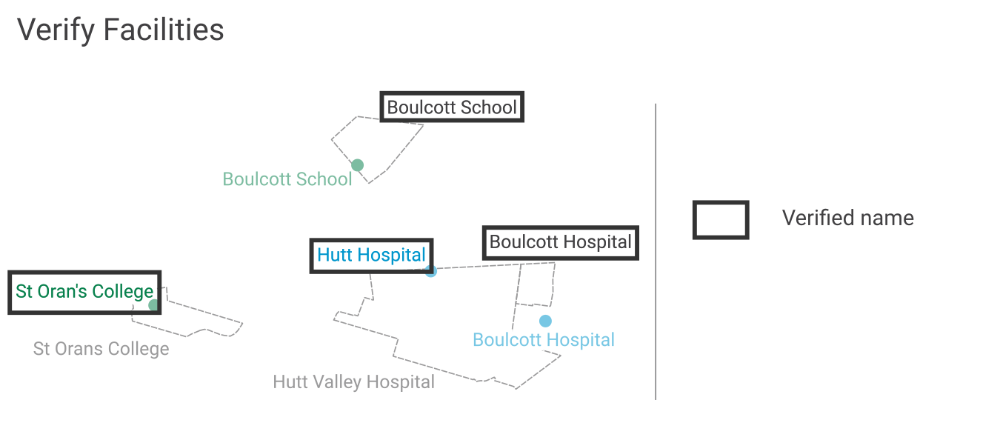

.. _introduction:

Introduction
============

Purpose
-------

This document provides detailed metadata (data dictionary) for the NZ Facilities data published on the LINZ Data Service: https://data.linz.govt.nz/layer/105568

Background
----------

The NZ Facilities dataset described here has been used to enrich the attributes for the existing `NZ Building Outlines <https://data.linz.govt.nz/layer/101290-nz-building-outlines/>`_, as well as provides additional open data for various stakeholders to map risk modelling, environmental assessment, urban development, resilience planning in addition to the visualization and physical location of facilities and the buildings within them.

Prior to publishing the NZ Facilities dataset, the `NZ Building Outlines <https://data.linz.govt.nz/layer/101290-nz-building-outlines/>`_ dataset contained name and use attributes of only supermarkets. The NZ Facilities dataset containing hospital and school facilities was used to help add hospital and school names and uses to the building outlines dataset.

The NZ Facilities data described below represents boundaries of facilities, currently hospitals and schools, within mainland New Zealand originally sourced in early 2021 from a combination of NationalMap and authoritative sources. Authoritative sources of these two types of attributes include the NZ Ministry of Health and NZ Ministry of Education.

Description
-----------

A facility represents a particular activity such as a hospital or school. A facility boundary represents the extent of the land which appears to be used by a facility. A facility boundary can be different to corresponding cadastral parcel polygons because a facility can span across multiple parcels or be located in only part of a parcel. For example, a parcel owned by the Crown can include multiple schools and other facilities such as parks and reserves.

NZ Facilities contains data sourced from `NationalMap <https://www.nationalmap.co.nz>`_, `Ministry of Education <https://www.educationcounts.govt.nz>`_ and `Ministry of Health <https://www.health.govt.nz>`_ licensed for reuse under `CC BY 4.0 <https://creativecommons.org/licenses/by/4.0/>`_.

The NZ Facilities data was produced by acquiring facility boundaries from NationalMap, and matching and verifying this against authoritative data from the Ministry of Health and the Ministry of Education. Finally the facility boundaries were used to assign names and uses to `NZ Building Outlines <https://data.linz.govt.nz/layer/101290-nz-building-outlines/>`_.

   Image 1. An overview of the NZ Facilities creation process, from source data to attributed facility boundaries, and finally to assigned `NZ Building Outlines <https://data.linz.govt.nz/layer/101290-nz-building-outlines/>`_.

Source Data
-----------
The source data for the NZ Facilities dataset comes from `NationalMap <https://www.nationalmap.co.nz>`_ Facility Boundaries, as well as `Ministry of Education <https://www.educationcounts.govt.nz>`_ and `Ministry of Health <https://www.health.govt.nz>`_ authoritative points.

   Image 2. Example of NationalMap facility boundaries and authoritative source points.

Verifying Facilities
--------------------

The NZ Facilities data was produced by acquiring facility boundaries from NationalMap, and verifying this against authoritative point data from the Ministry of Health and the Ministry of Education.

The process of verifying the NationalMap Facilities was accomplished by first matching names and locations to an authoritative point. The matches were checked for similarity of names and distance between locations. Those with disimilar names, or large distances, were investigated further and adjusted accordingly. LINZ Aerial Imagery was used to assist in manually correcting some boundary extents.

Assigning Attributes
--------------------

The NZ Facilities attributes are derived from the authoritative source attributes and have been standardised.

   Image 3. Example of NZ Facility boundaries with verified standardised names from an authoritative source, and attributes assigned.

name
^^^^
| A standardised name was created by applying a consistent naming convention to the authoritative name. This standardised name was assigned to the facility boundary, for example:
+----------------------------------------------+----------------------------------------------+
|               **Source Name**                |             **Standardised Name**            |
+----------------------------------------------+----------------------------------------------+
| Sacred Heart Girls' College (N Plymouth)     | Sacred Heart Girls' College (New Plymouth)   |
+----------------------------------------------+----------------------------------------------+
| TKKM o Takapau                               | Te Kura Kaupapa Māori o Takapau              |
+----------------------------------------------+----------------------------------------------+
| Rudolf Steiner School (Christchurch)         | Rudolf Steiner School (Chch)                 |
+----------------------------------------------+----------------------------------------------+

source_name and source_facility_id
^^^^^^^^^^^^^^^^^^^^^^^^^^^^^^^^^^
| The authoritative source's name and identifier are assigned to the data as *source_name* and *source_facility_id* to help users link the NZ Facilities to the authoritative source data, for example:
+----------------------------------------------+---------------------------------+-------------------------+
|               **Source Name**                |    **Source identifier**        |  **source_facility_id** |
+----------------------------------------------+---------------------------------+-------------------------+
| Sacred Heart Girls' College (N Plymouth)     |   School Number 174             |          174            |
+----------------------------------------------+---------------------------------+-------------------------+
| TKKM o Takapau                               |   School Number 1142            |         1142            |
+----------------------------------------------+---------------------------------+-------------------------+
| Belverdale Hospital                          |   HPI FacId F0F065-A            |        F0F065-A         |
+----------------------------------------------+---------------------------------+-------------------------+

use
^^^
| Assigned use based on the facility and provides the generic use of the facility, for example:
+----------------------------------------------+--------------------------------------------+-------------------------+
|               **Source Name**                |         **Source use**                     |       **use**           |
+----------------------------------------------+--------------------------------------------+-------------------------+
| Sacred Heart Girls' College (N Plymouth)     |   School Type Secondary (Year 7-15)        |        School           |
+----------------------------------------------+--------------------------------------------+-------------------------+
| Taumarunui Hospital and Family Health Team   | Certification Service Type Public Hospital |        Hospital         |
+----------------------------------------------+--------------------------------------------+-------------------------+
| Belverdale Hospital                          | Certification Service Type NGO Hospital    |        Hospital         |
+----------------------------------------------+--------------------------------------------+-------------------------+

use_type
^^^^^^^^
| The main categories of a facility as defined by the authoritative source, assigned to the data as *use_type*, for example:
+----------------------------------------------+--------------------------------------------+-------------------------+
|               **Source Name**                |         **Source Use Type**                |     **use_type**        |
+----------------------------------------------+--------------------------------------------+-------------------------+
| Sacred Heart Girls' College (N Plymouth)     |   School Type Secondary (Year 7-15)        |  Secondary (Year 7-15)  |
+----------------------------------------------+--------------------------------------------+-------------------------+
| Sacred Heart School (Dunedin)                |   School Type Contributing                 |     Contributing        |
+----------------------------------------------+--------------------------------------------+-------------------------+
| Taumarunui Hospital and Family Health Team   | Certification Service Type Public Hospital |   Public Hospital       |
+----------------------------------------------+--------------------------------------------+-------------------------+
| Belverdale Hospital                          | Certification Service Type NGO Hospital    |     NGO Hospital        |
+----------------------------------------------+--------------------------------------------+-------------------------+

use_subtype
^^^^^^^^^^^
| The additional subcategories of a facility as defined by the authoritative source, assigned to the data as *use_subtype*, for example:
+----------------------------------------------+--------------------------------------------+-------------------------+
|               **Source Name**                |         **Source Use Sub-Type**            |     **use_subtype**     |
+----------------------------------------------+--------------------------------------------+-------------------------+
| Taumarunui Hospital and Family Health Team   | Service Types Public Maternity, Medical    |   Maternity, Medical    |
+----------------------------------------------+--------------------------------------------+-------------------------+
| Belverdale Hospital                          | Service Types Surgical                     |        Surgical         |
+----------------------------------------------+--------------------------------------------+-------------------------+

estimated_occupancy
^^^^^^^^^^^^^^^^^^^
The approximate occupancy of the facility from the authoritative source, where this is known. This number may not include staff of the facility, but provides for example, the number of beds in hospitals or students in schools.
+----------------------------------------------+--------------------------------------------+-------------------------+
|               **Source Name**                |         **Source Occupancy**               | **estimated_occupancy** |
+----------------------------------------------+--------------------------------------------+-------------------------+
| Sacred Heart School (Dunedin)                | Total School Roll 33                       |        33               |
+----------------------------------------------+--------------------------------------------+-------------------------+
| Taumarunui Hospital and Family Health Team   | Total Beds 14                              |        14               |
+----------------------------------------------+--------------------------------------------+-------------------------+
| Belverdale Hospital                          | Total Beds 15                              |        15               |
+----------------------------------------------+------------------------------- ------------+-------------------------+

last_modified
^^^^^^^^^^^^^

The most recent date on which any attribute or geometry that is part of the facility was modified.

Assigning Name and Use to `NZ Building Outlines <https://data.linz.govt.nz/layer/101290-nz-building-outlines/>`_
-----------------------------------------------------------------------------------------------------------------

Facility boundaries in this dataset were used to apply hospital and school building names to the `NZ Building Outlines <https://data.linz.govt.nz/layer/101290-nz-building-outlines/>`_ dataset published on the LINZ Data Service. NZ Facilities and `NZ Building Outlines <https://data.linz.govt.nz/layer/101290-nz-building-outlines/>`_ were compared and any building outline whose centroid intersected with a facility boundary, was assign the name and use of that facility boundary.

   Image 4. Example of using NZ Facilities boundaries to assign name and use to building outlines.

Accuracy Specification
----------------------

Formats
-------

Textual data uses UTF-8 character encoding.

The source geometry of all spatial data uses NZGD2000 / New Zealand Transverse Mercator 2000 (EPSG 2193) as the spatial reference system. NZ Facilities geometries are stored as MultiPolygons.

Definitions
-----------

.. table::
   :class: manual

+-------------------+----------------------------------------------------------------------+
| Term              | Description                                                          |
+===================+======================================================================+
| LDS               | LINZ Data Service                                                    |
+-------------------+----------------------------------------------------------------------+
| Facility          | A place of a particular activity such as a hospital or school, which |
|                   | is often more than one building.                                     |
+-------------------+----------------------------------------------------------------------+
| Facility boundary | A boundary representing the extent of the land which appears to be   |
|                   | used by a facility.                                                  |
+-------------------+----------------------------------------------------------------------+
| Building          | A structure generally permanent in nature which has been constructed |
|                   | to meet a specific objective (e.g. housing, storage, and workplace). |
|                   |                                                                      |
+-------------------+----------------------------------------------------------------------+
| Building Outlines | A building outline is a 2D representation of the roof outline of a   |
|                   | building.                                                            |
|                   |                                                                      |
+-------------------+----------------------------------------------------------------------+
